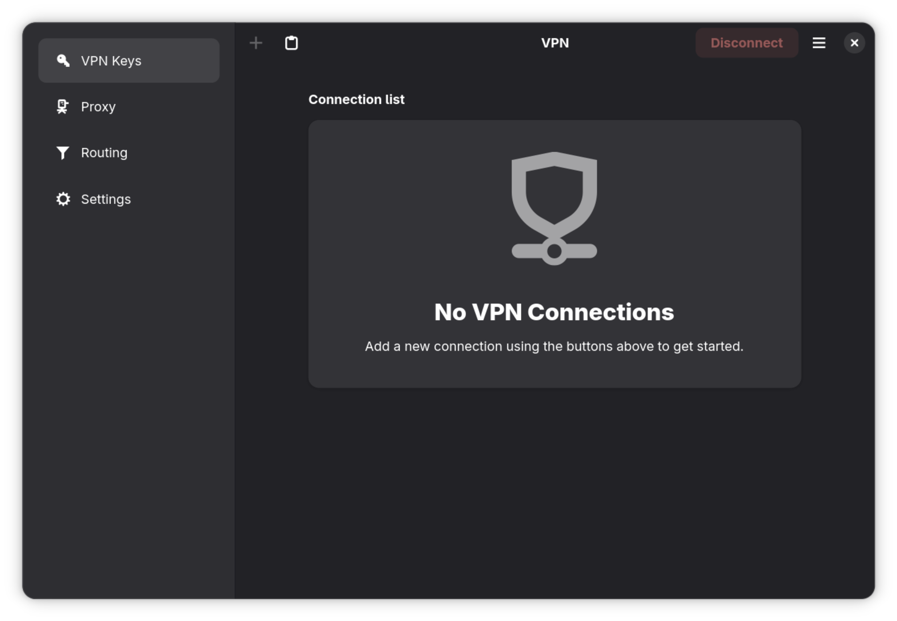
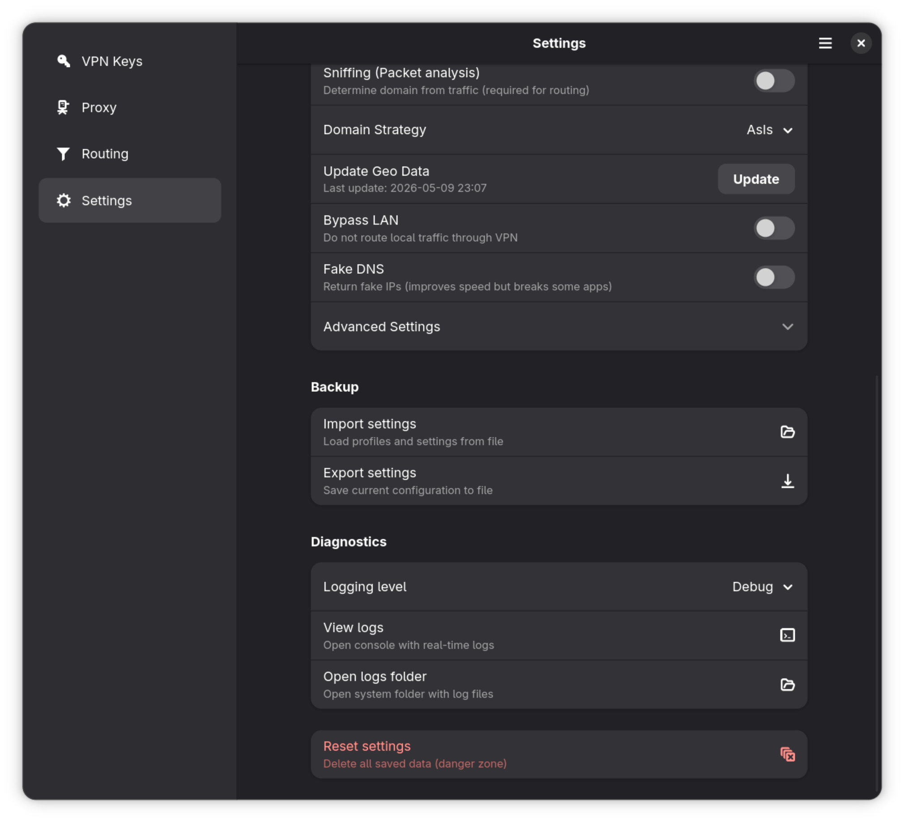
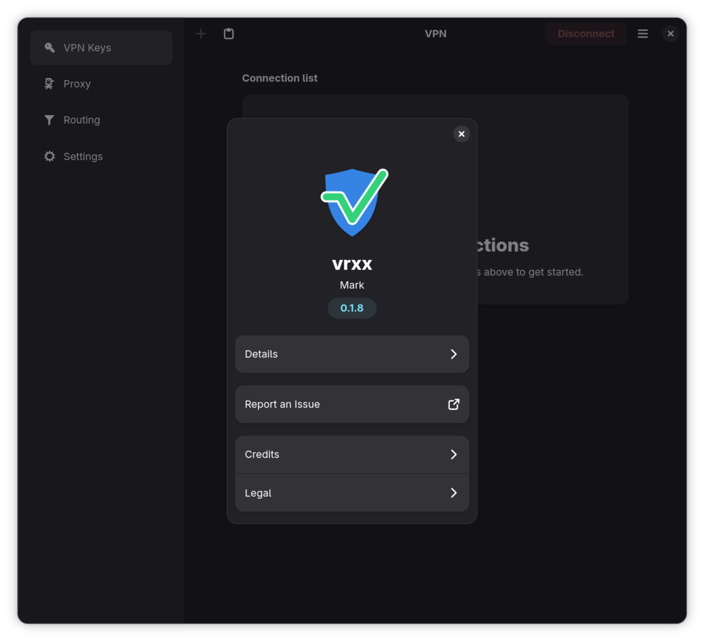

# VRXX

Современный, высокопроизводительный графический клиент для **Sing-box** на Linux, написанный на `Rust` с использованием `GTK4` и `Libadwaita`.

Приложение совмещает:

- нативный GNOME-интерфейс для управления VPN-подключениями;
- привилегированный системный демон с REST API для управления ядром и сетевым стеком;
- генерацию JSON-конфигурации Sing-box с учётом версии ядра (1.8 / 1.11+ / 1.12+);
- продвинутую маршрутизацию с региональными пресетами (RU, CN, IR, Antifilter);
- живую статистику трафика через Clash API и потоковые логи через SSE;
- автоматическую установку и обновление ядра Sing-box.

README описывает фактическое состояние проекта на текущий момент, включая реализованные возможности и известные ограничения.

## Содержание

- [Назначение проекта](#назначение-проекта)
- [Скриншоты](#скриншоты)
- [Текущий статус](#текущий-статус)
- [Технологический стек](#технологический-стек)
- [Зависимости и версии](#зависимости-и-версии)
- [Требования к окружению](#требования-к-окружению)
- [Установка и запуск](#установка-и-запуск)
- [Скрипты](#скрипты)
- [CI/CD](#cicd)
- [Поддерживаемые протоколы](#поддерживаемые-протоколы)
- [REST API демона](#rest-api-демона)
- [Данные и хранилища](#данные-и-хранилища)
- [Структура проекта](#структура-проекта)
- [Диагностика и логи](#диагностика-и-логи)
- [Локализация](#локализация)
- [Документация](#документация)
- [Разработка и вклад в проект](#разработка-и-вклад-в-проект)
- [Лицензия](#лицензия)

## Назначение проекта

VRXX предназначен для удобного управления VPN-подключениями на Linux-десктопах и включает следующие сценарии использования:

- импорт VPN-ключей из буфера обмена или URL (VLESS, VMess, Trojan, Shadowsocks);
- подключение к VPN-серверу через Sing-box с поддержкой TUN-режима (прозрачное проксирование);
- мониторинг трафика, пинга, времени подключения и геолокации сервера в реальном времени;
- гибкая маршрутизация: обход LAN, региональные правила (RU, CN, IR), блокировка рекламы;
- режим стримера: скрытие IP-адресов и SNI при демонстрации экрана;
- автоматическая установка и обновление ядра Sing-box из GitHub Releases;
- фоновое обновление баз GeoIP/GeoSite каждые 24 часа;
- полная поддержка русского и английского языков интерфейса.

## Скриншоты

| Главный экран | Настройки | О программе |
|:---:|:---:|:---:|
|  |  |  |

## Текущий статус

Проект активно развивается. Ниже — честная картина по состоянию на текущий момент.

### ✅ Полностью реализовано

**Управление подключениями:**
- Импорт VPN-ключей из буфера обмена и URL-строки
- Поддержка протоколов VLESS (Reality, TLS, uTLS), VMess (Base64 JSON), Trojan
- Подключение/отключение через привилегированный демон
- Живая статистика: трафик (↓/↑), время подключения, пинг
- Автоматическое определение геолокации и часового пояса сервера
- Режим стримера: скрытие IP-адресов и SNI в интерфейсе

**Сетевой стек:**
- TUN-режим с автоматической настройкой маршрутов (gVisor стек, `auto_route`, `strict_route`)
- SOCKS5 и HTTP прокси с настраиваемыми портами
- Настройка системного прокси GNOME через GSettings
- DNS через systemd-resolved (D-Bus API)
- Региональная маршрутизация: RU, CN, IR, Antifilter (через удалённые SRS-наборы правил)
- Блокировка рекламы через удалённые rule sets
- Блокировка IPv6, обход LAN, пользовательские правила маршрутизации (домены, IP, SRS URL)

**Конфигурация ядра:**
- Версионно-адаптивная генерация конфигурации Sing-box (1.8 / 1.11+ / 1.12+)
- TLS + Reality + uTLS fingerprinting (Chrome по умолчанию)
- Транспорт: gRPC, WebSocket
- DNS: удалённый (Cloudflare HTTPS через прокси) + локальный
- Мультиплексирование (smux)
- Clash API для мониторинга статистики (127.0.0.1:9090)

**Пользовательский интерфейс:**
- Нативный GNOME-дизайн (Libadwaita 1.5+, соответствие HIG)
- 4 основных страницы: VPN, Прокси, Белый список, Настройки
- Переключение тем: светлая, тёмная, системная
- Масштабирование интерфейса (Ctrl+/Ctrl-/Ctrl+0)
- Отдельное окно логов с потоковым отображением (SSE + чтение файлов)
- Автоматическая установка и обновление ядра Sing-box с прогресс-баром
- Импорт и экспорт настроек через JSON-файлы
- Сброс настроек к значениям по умолчанию
- Сочетания клавиш: Ctrl+Q (выход), Ctrl+D (отключение)

**Инфраструктура:**
- Привилегированный демон с REST API (Axum, 127.0.0.1:13337)
- SSE-стриминг событий (статус, логи) от демона к GUI
- SSD-friendly асинхронное логирование с разделением на потоки (`tracing` + `tracing-appender`)
- Конфигурация ядра передаётся через stdin (никогда не записывается на диск)
- Безопасное хранение настроек (permissions 0o600)
- Фоновое обновление баз GeoIP/GeoSite (автоматически каждые 24 часа)
- D-Bus конфигурация и PolicyKit для авторизации привилегированных операций
- CI/CD: `cargo check` + `cargo test` + `cargo clippy` при каждом пуше
- GitHub Actions Release: автоматическая сборка бинарника и публикация при создании тега
- Локализация через gettext (русский, английский)
- Скрипты установки, обновления и удаления

### 🚧 В процессе / Частично реализовано

- Поддержка Shadowsocks: парсинг ключей работает, генерация конфигурации частичная
- Поддержка WireGuard, SOCKS и HTTP: типы определены в `protocol.rs`, интеграция с ядром не завершена
- Flatpak: манифест (`ru.mark.vrxx.json`) присутствует, но сборка не автоматизирована в CI
- AppStream метаданные (`metainfo.xml.in`): содержат placeholder-значения
- Фрагментация пакетов (`enable_fragment`): настройка в UI есть, реализация в конфигурации ядра не завершена

## Технологический стек

- `Rust` (edition 2021) — основной язык
- `GTK4` 4.14+ с `Libadwaita` 1.5+ — нативный GNOME-интерфейс
- `Tokio` — асинхронный runtime для демона и сетевых операций
- `Axum` — REST API сервер привилегированного демона
- `reqwest` — HTTP-клиент для загрузки ядра и геобаз; SSE-подписки через `reqwest-eventsource`
- `tun-rs` + `rtnetlink` — управление TUN-интерфейсом и маршрутами на уровне ядра Linux
- `zbus` — D-Bus клиент для взаимодействия с `systemd-resolved` (DNS)
- `serde` + `serde_json` — сериализация настроек и генерация JSON-конфигурации Sing-box
- `tracing` + `tracing-subscriber` + `tracing-appender` — структурированное асинхронное логирование
- `anyhow` + `thiserror` — обработка ошибок
- `gettext-rs` — интернационализация (i18n)
- `GResource` + `glib-compile-resources` — компиляция UI-файлов в бинарник
- `Meson` — альтернативная система сборки для Flatpak и системной установки

## Зависимости и версии

### Основные зависимости (Cargo.toml)

| Крейт | Версия | Назначение |
| --- | --- | --- |
| `gtk4` | 0.9 (features: `v4_14`) | GTK4 UI toolkit |
| `libadwaita` | 0.7 (features: `v1_5`) | GNOME Libadwaita виджеты |
| `gdk4` | 0.9 | GDK4 backend |
| `tokio` | 1 (features: `full`) | Асинхронный runtime |
| `axum` | 0.8.9 | REST API сервер демона |
| `axum-extra` | 0.12.6 | Расширения Axum |
| `reqwest` | 0.12 (features: `socks`, `json`, `rustls-tls-native-roots`) | HTTP-клиент |
| `reqwest-eventsource` | 0.6.0 | SSE-клиент для подписки на события |
| `ureq` | 2.9 (features: `socks-proxy`, `json`) | Синхронный HTTP-клиент |
| `serde` | 1.0.228 (features: `derive`) | Сериализация/десериализация |
| `serde_json` | 1.0.149 | Работа с JSON |
| `anyhow` | 1.0 | Удобная обработка ошибок |
| `thiserror` | 1.0 | Пользовательские типы ошибок |
| `tracing` | 0.1.44 | Структурированное логирование |
| `tracing-subscriber` | 0.3.23 | Подписчик логов |
| `tracing-appender` | 0.2.4 | Неблокирующая запись логов в файлы |
| `tun-rs` | 2.8.2 (features: `async`) | Создание TUN-интерфейса |
| `rtnetlink` | 0.20.0 | Управление маршрутами через Netlink |
| `zbus` | 5.15.0 (features: `tokio`) | D-Bus клиент (systemd-resolved) |
| `ipnet` | 2.12.0 | Типы IP-сетей |
| `async-channel` | 2.3 | Асинхронные каналы (GUI ↔ демон) |
| `futures-util` | 0.3 | Комбинаторы для Future |
| `tokio-stream` | 0.1.18 (features: `sync`) | Потоки данных Tokio |
| `gettext-rs` | 0.7 (features: `gettext-system`) | Интернационализация |
| `nix` | 0.31.2 (features: `signal`) | Unix-сигналы (SIGTERM/SIGKILL) |
| `base64` | 0.22.1 | Кодирование/декодирование VMess ключей |
| `chrono` | 0.4.44 | Дата и время |
| `dirs` | 6.0.0 | Стандартные директории платформы |
| `percent-encoding` | 2.3.2 | URL-кодирование |
| `regex` | 1.12.3 | Регулярные выражения |
| `tempfile` | 3.27.0 | Временные файлы |
| `url` | 2.5.8 | Парсинг URL |

## Требования к окружению

### Системные зависимости

| Инструмент | Версия | Обязательность |
| --- | --- | --- |
| Rust (rustup) | 1.80+ | Обязательно |
| GTK4 | 4.16+ | Обязательно |
| Libadwaita | 1.6+ | Обязательно |
| libssl (OpenSSL) | — | Обязательно |
| pkg-config | — | Обязательно |
| gettext | — | Обязательно |
| Meson | 1.0+ | Опционально (для системной установки) |

### Поддерживаемые ядра

Приложение требует наличия бинарного файла Sing-box. Ядро может быть установлено автоматически через встроенный инсталлятор.

| Ядро | Минимальная версия | Рекомендуемая версия |
| --- | --- | --- |
| Sing-box | 1.8.0 | 1.12+ (полная поддержка всех функций) |

> **Примечание:** VRXX автоматически определяет версию установленного Sing-box и адаптирует генерируемую конфигурацию: v1.8 — базовый набор, v1.11+ — новый механизм сниффинга, v1.12+ — `domain_resolver`, DNS-правила и IPv6 `reject`.

## Установка и запуск

### 1. Установка системных зависимостей

**Ubuntu / Debian:**
```bash
sudo apt install libgtk-4-dev libadwaita-1-dev libssl-dev pkg-config gettext
```

**Arch / Manjaro:**
```bash
sudo pacman -S gtk4 libadwaita openssl pkg-config gettext
```

**Fedora:**
```bash
sudo dnf install gtk4-devel libadwaita-devel openssl-devel pkg-config gettext
```

### 2. Сборка из исходного кода

```bash
git clone https://github.com/Mark-TinZ/vrxx
cd vrxx
cargo build --release
```

### 3. Запуск

Приложение работает в двухпроцессной модели: привилегированный демон + GUI.

```bash
# Запуск демона (требует root для TUN и управления сетью)
sudo ./target/release/vrxx --daemon &

# Запуск графического интерфейса
./target/release/vrxx
```

### 4. Установка в систему

```bash
# Автоматическая установка (бинарник, иконка, .desktop файл)
./scripts/install.sh
```

После установки VRXX появится в меню приложений GNOME.

## Скрипты

| Скрипт | Назначение |
| --- | --- |
| `scripts/install.sh` | Сборка + установка в `/usr/local/bin/`, иконка, `.desktop` файл, обновление кэшей |
| `scripts/update.sh` | Пересборка + обновление системных файлов |
| `scripts/uninstall.sh` | Удаление бинарника, иконки и `.desktop` файла (настройки в `~/.config/vrxx/` сохраняются) |

## CI/CD

Репозиторий содержит два GitHub Actions workflow:

### `rust.yml` — CI при каждом пуше и PR в `main`

1. `cargo check` — проверка компиляции
2. `cargo test` — запуск тестов (через `xvfb-run` для GTK)
3. `cargo clippy -- -D warnings` — линтинг без предупреждений

### `release.yml` — Релизная сборка при создании тега

1. `cargo build --release`
2. Упаковка `vrxx-linux-x86_64.tar.gz` + SHA256 checksum
3. Публикация GitHub Release через `softprops/action-gh-release`

## Поддерживаемые протоколы

| Протокол | Схема URI | Парсинг | Генерация конфигурации |
| --- | --- | --- | --- |
| VLESS | `vless://` | ✅ полный | ✅ полный (TLS, Reality, uTLS, Flow) |
| VMess | `vmess://` (Base64 JSON) | ✅ полный | ✅ полный (XUDP, auto security) |
| Trojan | `trojan://` | ✅ полный | ✅ полный |
| Shadowsocks | `ss://` | ✅ базовый | 🚧 частичный |
| WireGuard | — | 📋 тип определён | ❌ не реализовано |
| SOCKS | — | 📋 тип определён | ❌ не реализовано |
| HTTP | — | 📋 тип определён | ❌ не реализовано |

## REST API демона

Демон запускается на `127.0.0.1:13337` (только localhost) и предоставляет следующие эндпоинты:

| Метод | Маршрут | Описание |
| --- | --- | --- |
| `GET` | `/api/ping` | Health check, возвращает `"pong"` |
| `GET` | `/api/status` | Текущий статус: `Disconnected`, `Connecting`, `Connected`, `Disconnecting`, `Error` |
| `GET` | `/api/is_running` | Проверка, запущен ли процесс ядра (JSON boolean) |
| `POST` | `/api/proxy/start` | Запуск прокси. Тело: `{ core_type, config_json, tun_mode }` |
| `POST` | `/api/proxy/stop` | Остановка прокси (SIGTERM → 5с таймаут → SIGKILL) |
| `GET` | `/api/events` | SSE-поток событий: `StatusChanged`, `Log { level, message }` |
| `GET` | `/api/history` | Последние N лог-событий из кольцевого буфера |

## Данные и хранилища

### Пользовательские данные

| Путь | Назначение | Права |
| --- | --- | --- |
| `~/.config/vrxx/settings.json` | Все настройки приложения, VPN-ключи, правила маршрутизации | `0o600` |
| `~/.config/vrxx/logs/app.log` | Логи GUI | `0o600` |
| `~/.config/vrxx/logs/daemon.log` | Логи демона | `0o600` |
| `~/.config/vrxx/logs/all.log` | Объединённый поток логов | `0o600` |
| `~/.config/vrxx/geosite.dat` | База GeoSite (Loyalsoldier) | `0o600` |
| `~/.config/vrxx/geoip.dat` | База GeoIP (Loyalsoldier) | `0o600` |
| `~/.config/vrxx/geosite_ru.dat` | База GeoSite для RU (runet-geodata) | `0o600` |
| `~/.config/vrxx/geoip_ru.dat` | База GeoIP для RU (runet-geodata) | `0o600` |
| `~/.config/vrxx/geosite_antifilter.dat` | База GeoSite Antifilter | `0o600` |
| `~/.local/share/vrxx/bin/sing-box` | Бинарник ядра Sing-box (установленный через GUI) | `0o755` |

### Системные файлы (при установке через скрипт)

| Путь | Назначение |
| --- | --- |
| `/usr/local/bin/vrxx` | Бинарный файл приложения |
| `/usr/share/icons/hicolor/scalable/apps/ru.mark.vrxx.svg` | Иконка приложения |
| `/usr/share/applications/ru.mark.vrxx.desktop` | Ярлык в меню приложений |

## Структура проекта

```text
.
├─ .github/
│  └─ workflows/
│     ├─ rust.yml                   # CI: check + test + clippy
│     └─ release.yml                # Релизная сборка + GitHub Release
├─ data/
│  ├─ icons/                        # SVG-иконки приложения (hicolor)
│  ├─ meson.build                   # Meson: установка данных
│  ├─ ru.mark.vrxx.daemon.conf      # D-Bus конфигурация демона
│  ├─ ru.mark.vrxx.daemon.service.in # Systemd unit для D-Bus активации
│  ├─ ru.mark.vrxx.desktop.in       # Шаблон .desktop файла (для Meson)
│  ├─ ru.mark.vrxx.gschema.xml      # GSettings схема
│  ├─ ru.mark.vrxx.metainfo.xml.in  # AppStream метаданные
│  ├─ ru.mark.vrxx.policy           # PolicyKit политика (start/stop proxy)
│  └─ ru.mark.vrxx.service.in       # Systemd unit для D-Bus активации GUI
├─ docs/
│  ├─ 01-setup.md                   # Установка и запуск
│  ├─ 02-architecture.md            # Архитектура проекта
│  ├─ 03-daemon.md                  # Привилегированный демон
│  ├─ 04-ui.md                      # Пользовательский интерфейс
│  ├─ 05-domain.md                  # Протоколы и конфигурация ядра
│  ├─ 06-settings.md                # Настройки приложения
│  ├─ 07-logging.md                 # Система логирования
│  ├─ 08-localization.md            # Локализация
│  ├─ vpn_page.png                  # Скриншот: главный экран
│  ├─ settings_page.png             # Скриншот: настройки
│  └─ about_dialog.png              # Скриншот: диалог «О программе»
├─ locale/                          # Скомпилированные .mo файлы (генерируются при сборке)
├─ po/
│  ├─ LINGUAS                       # Список поддерживаемых языков
│  ├─ POTFILES.in                   # Исходные файлы с переводимыми строками (33 файла)
│  ├─ vrxx.pot                      # Шаблон переводов
│  ├─ ru.po                         # Русский перевод
│  └─ en.po                         # Английский перевод
├─ scripts/
│  ├─ install.sh                    # Сборка + установка в систему
│  ├─ update.sh                     # Пересборка + обновление
│  └─ uninstall.sh                  # Удаление из системы
├─ src/
│  ├─ main.rs                       # Точка входа: аргументы, логирование, gettext, GResource, запуск
│  ├─ application.rs                # VrxxApplication: GActions, меню, about dialog, импорт/экспорт
│  ├─ window.rs                     # VrxxWindow: навигация по страницам, статус-бар, поллинг
│  ├─ backend.rs                    # CoreBackend: высокоуровневый интерфейс к демону (VpnCore trait)
│  ├─ ipc.rs                        # DaemonClient: HTTP/SSE клиент к демону (REST API + SSE подписки)
│  ├─ protocol.rs                   # ProtocolSettings: определение типов протоколов
│  ├─ settings.rs                   # AppSettings + SettingsManager: настройки, VPN-ключи, маршрутизация
│  ├─ config.rs                     # Константы сборки (VERSION, GETTEXT_PACKAGE, LOCALEDIR)
│  ├─ daemon/
│  │  ├─ mod.rs                     # Точка входа демона: run(), run_with_manager()
│  │  ├─ api.rs                     # Axum роутер: REST API эндпоинты демона
│  │  ├─ core.rs                    # ProxyManager: жизненный цикл процесса Sing-box
│  │  ├─ events.rs                  # EventManager + SseTracingLayer: SSE стриминг и кольцевой буфер
│  │  ├─ network.rs                 # TunManager: создание TUN, маршруты, ip rule
│  │  ├─ dns.rs                     # DnsManager: systemd-resolved через D-Bus (zbus)
│  │  ├─ updater.rs                 # Установка/обновление Sing-box из GitHub Releases
│  │  └─ tests.rs                   # Тесты демона
│  ├─ domain/
│  │  ├─ mod.rs                     # Реэкспорт модулей
│  │  ├─ key_parser.rs              # Парсинг VPN-ключей (VLESS, VMess, Trojan, SS) + реконструкция URL
│  │  └─ singbox_config.rs          # Генерация JSON-конфигурации Sing-box (версионно-адаптивная)
│  ├─ services/
│  │  ├─ mod.rs                     # Реэкспорт модулей
│  │  └─ geo_updater.rs             # Фоновое обновление GeoIP/GeoSite баз (каждые 24ч)
│  └─ ui/
│     ├─ mod.rs                     # Реэкспорт страниц и компонентов
│     ├─ models.rs                  # GLib Object Model: VpnKeyObject, DomainObject, RoutingRuleObject
│     ├─ tests.rs                   # UI тесты
│     ├─ proxy_tests.rs             # Тесты прокси-логики
│     ├─ menus.ui                   # Определение главного меню (XML)
│     ├─ pages/
│     │  ├─ mod.rs                  # Реэкспорт страниц
│     │  ├─ vpn_page.rs / .ui       # Страница VPN: список ключей, подключение, статистика
│     │  ├─ proxy_page.rs / .ui     # Страница настроек прокси
│     │  ├─ whitelist_page.rs / .ui # Страница белого списка и правил маршрутизации
│     │  └─ settings_page.rs / .ui  # Страница настроек приложения
│     └─ components/
│        ├─ mod.rs                  # Реэкспорт компонентов
│        ├─ vpn_key_row.rs / .ui    # Виджет строки VPN-ключа
│        ├─ theme_switcher.rs / .ui # Виджет переключения темы
│        ├─ log_window.rs / .ui     # Окно просмотра логов (SSE + файлы)
│        └─ core_installer.rs       # Диалог установки ядра Sing-box
├─ build.rs                         # Компиляция GResource, PO-файлов, config fallback
├─ Cargo.toml                       # Манифест Rust-проекта
├─ Cargo.lock                       # Заблокированные версии зависимостей
├─ meson.build                      # Корневой Meson build (для системной установки / Flatpak)
├─ ru.mark.vrxx.desktop             # Ярлык приложения для GNOME
├─ ru.mark.vrxx.json                # Flatpak манифест (GNOME SDK 50)
├─ CONTRIBUTING.md                  # Руководство по разработке
├─ COPYING                          # Лицензия MPL-2.0
└─ README.md                        # Этот файл
```

## Диагностика и логи

Логи разделены по категориям и хранятся в `~/.config/vrxx/logs/`:

| Файл | Содержимое |
| --- | --- |
| `app.log` | Логи графического интерфейса |
| `daemon.log` | Логи системного демона (создаётся при запуске с `--daemon`) |
| `all.log` | Объединённый поток всех событий |

Для просмотра логов можно использовать:

- **Встроенное окно логов**: меню `☰` → `Логи` или действие `app.view_logs`
- **Открыть директорию логов**: меню `☰` → `Открыть папку логов`
- **Терминал**: `tail -f ~/.config/vrxx/logs/all.log`

Для увеличения детализации измените `log_level` в настройках на `debug` или `trace`.

## Локализация

Приложение поддерживает интернационализацию через `gettext`:

| Язык | Код | Статус |
| --- | --- | --- |
| Русский | `ru` | ✅ полный перевод |
| Английский | `en` | ✅ полный перевод |

Язык выбирается в настройках приложения. Значение `system` автоматически определяет язык по системным переменным окружения (`LANGUAGE`, `LC_ALL`, `LANG`).

Подробнее о добавлении новых языков — в [docs/08-localization.md](docs/08-localization.md).

## Документация

Подробная документация находится в директории `docs/`:

| Файл | Содержание |
| --- | --- |
| [01-setup.md](docs/01-setup.md) | Установка, запуск, конфигурация |
| [02-architecture.md](docs/02-architecture.md) | Архитектура: GUI ↔ Демон ↔ Ядро |
| [03-daemon.md](docs/03-daemon.md) | REST API демона, TUN, DNS, SSE |
| [04-ui.md](docs/04-ui.md) | Страницы, компоненты, GLib модели |
| [05-domain.md](docs/05-domain.md) | Парсинг ключей, генерация конфигурации |
| [06-settings.md](docs/06-settings.md) | Настройки приложения, безопасность |
| [07-logging.md](docs/07-logging.md) | Система логирования, tracing, SSE |
| [08-localization.md](docs/08-localization.md) | Gettext, PO-файлы, добавление языков |

## Разработка и вклад в проект

Правила командной работы описаны в [CONTRIBUTING.md](CONTRIBUTING.md). Ключевые моменты:

- перед началом работы синхронизируйтесь с `main`;
- используйте отдельную ветку под каждую задачу;
- обязательно запускайте `cargo fmt` и `cargo clippy -- -D warnings` перед коммитом;
- запрещено использовать `.unwrap()` и `.expect()` вне тестов;
- главный поток GTK **не должен блокироваться** I/O-операциями.

Перед созданием Pull Request:

```bash
cargo fmt
cargo clippy -- -D warnings
cargo test
```

## Быстрый пример использования

```bash
# 1. Установка зависимостей (Ubuntu)
sudo apt install libgtk-4-dev libadwaita-1-dev libssl-dev pkg-config gettext

# 2. Сборка
git clone https://github.com/Mark-TinZ/vrxx && cd vrxx
cargo build --release

# 3. Запуск
sudo ./target/release/vrxx --daemon &
./target/release/vrxx

# 4. Импортируйте VPN-ключ из буфера обмена и нажмите «Подключить»
```

## Лицензия

Этот проект лицензирован на условиях [Mozilla Public License 2.0](COPYING).
