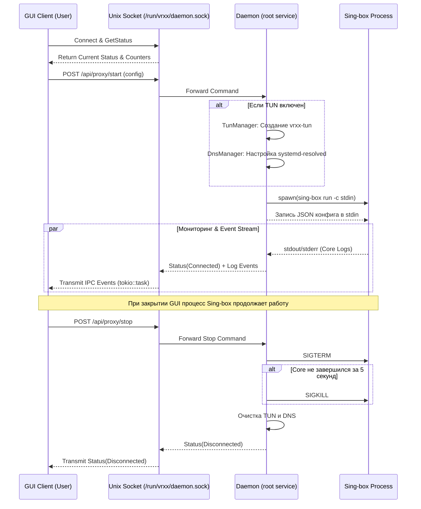

# 02. Архитектура

## Обзор

VRXX построен по строгой трёхслойной архитектуре с разделением привилегий. Такое разделение необходимо для обеспечения безопасности (не все компоненты должны работать от имени `root`) и отзывчивости (тяжёлые сетевые операции не должны блокировать UI-поток).

Три основных слоя приложения:
1. **Слой UI (GTK4/Libadwaita и Ratatui TUI)** — некомпонентный фронтенд (GUI на GTK4 или интерактивный консольный TUI на `ratatui`), работающий с обычными правами пользователя.
2. **Слой Backend (Привилегированный демон `vrxx-daemon`)** — фоновый системный сервис, работающий от имени `root` (через `/usr/lib/systemd/system/vrxx-daemon.service`) и предоставляющий IPC-интерфейс через Unix Domain Socket (`/run/vrxx/daemon.sock`).
3. **Слой Domain (Данные и конфигурация)** — бизнес-логика (парсинг ключей, генерация конфигов), переиспользуемая обоими слоями.


## Диаграмма архитектуры

```mermaid
flowchart TD
    User([Пользователь]) --> UI

    subgraph "Слой UI (GTK4, User Mode)"
        UI[VrxxApplication / VrxxWindow]
        SettingsUI[Настройки, Страницы]
        DaemonClient[IPC DaemonClient\ntokio::task]
        
        UI <--> SettingsUI
        UI --> DaemonClient
    end

    subgraph "Слой Backend (Systemd Service, Root Mode)"
        UnixListener[Tokio Async Unix Listener\n/run/vrxx/daemon.sock]
        ProxyMgr[Proxy Manager]
        TunMgr[TUN Manager]
        DnsMgr[DNS Manager]
        EventMgr[Event Manager\nSSE / IPC Event Stream]
        GeoUpdate[Geo Updater]
        
        UnixListener --> ProxyMgr
        UnixListener --> EventMgr
        ProxyMgr --> TunMgr
        ProxyMgr --> DnsMgr
        EventMgr -.->|Logs & Status| UnixListener
    end
    
    subgraph "Слой Core (Sing-box)"
        CoreProcess[Sing-box Process]
    end

    DaemonClient -- "IPC Requests (Unix Socket)" --> UnixListener
    DaemonClient <.. "IPC Event Stream" .. UnixListener
    
    ProxyMgr -- "stdin config\nspawn" --> CoreProcess
    CoreProcess -. "stdout/stderr" .-> EventMgr
```

## Слой UI (GTK4/Libadwaita)

Графический интерфейс построен с использованием крейтов `gtk4` и `libadwaita`.
- **Композитные шаблоны**: UI описывается в XML-файлах `.ui`, которые привязываются к Rust-структурам (паттерн Composite Template). 
- **GResource**: Файлы `.ui` компилируются прямо в исполняемый бинарник через систему `glib-compile-resources` (путь ресурсов `/ru/mark/vrxx/`).
- **GObject / Gio Models**: Для списков данных используются модели, такие как `gio::ListStore`, хранящие объекты `VpnKeyObject`, `DomainObject` и `RoutingRuleObject`.
- **4 основные страницы**: VPN (главная), Прокси, Белый список, Настройки. Переключение осуществляется через боковую панель `AdwNavigationSplitView` с поддержкой адаптивного `AdwBreakpoint`.
- **Кросс-десктопный Fallback**: Определение среды (`XDG_CURRENT_DESKTOP`) и безопасная проверка наличия схем GSettings (`is_gnome_proxy_schema_available()`) в `src/backend.rs` с предложением перехода в TUN-режим через `AdwToast` на KDE/XFCE/Sway.
- **Асинхронный опрос и IPC**: Все сетевые операции и опрос Unix-сокета выполняются в отдельной `tokio::task`, исключая блокировку главного потока UI (GTK main loop).

## Слой Backend (Привилегированный демон)

Поскольку для настройки TUN-интерфейса, управления маршрутами и D-Bus конфигурацией системного DNS требуются права суперпользователя (`root`), эти задачи вынесены в фоновый системный демон `vrxx-daemon`.

- **Системный сервис:** Устанавливается в `/usr/lib/systemd/system/vrxx-daemon.service` и запускается от пользователя `root`.
- **Unix Domain Socket:** Демон слушает сокет `/run/vrxx/daemon.sock` (права `0666` или группа `wheel`/`vrxx`) через `Tokio Async Unix Listener`.
- **Компоненты демона:**
  - **ProxyManager**: управляет жизненным циклом процесса Sing-box (запуск `sing-box run -c stdin`, остановка, мониторинг падений).
  - **TunManager**: создает интерфейс `vrxx-tun` через `tun-rs` и настраивает маршруты ядра через `rtnetlink`.
  - **DnsManager**: взаимодействует с `systemd-resolved` по D-Bus (крейт `zbus`) для перенаправления DNS-запросов в туннель.
  - **EventManager**: кольцевой буфер и широковещательный канал для трансляции логов и событий в реальном времени.

## Слой Domain (Данные и конфигурация)

Этот слой содержит независимую бизнес-логику:
- **`key_parser.rs`**: Универсальный парсер VPN-ключей, который разбирает протоколы (VLESS, VMess, Trojan, SS) в структуру `ParsedKey`.
- **`singbox_config.rs`**: Генератор сложного JSON для Sing-box на основе `ParsedKey` и пользовательских настроек (подробнее в `docs/05-domain.md`).
- **`settings.rs`**: Структура настроек приложения (`AppSettings`) и менеджер сериализации.
- **`protocol.rs`**: Описание типов протоколов и их специфичных полей.

## Модель IPC (Межпроцессное взаимодействие)

Связь между UI и демоном реализована через Unix Domain Socket `/run/vrxx/daemon.sock`. Код инкапсулирован в `DaemonClient` (`ipc.rs`).

- **Управляющие команды**: Выполняются как асинхронные IPC/JSON-RPC запросы (`POST /api/proxy/start`, `POST /api/proxy/stop`).
- **Запрос состояния (`GetStatus`)**: Клиент опрашивает `/api/status` при старте для получения статуса соединения, переданных байтов и активного профиля.
- **События реального времени**: UI подписывается на поток событий (`GET /api/events`), получая непрерывный поток изменений статуса (`StatusChanged`) и лог-сообщений (`Log`).
- **Непрерывность работы и восстановление**: При закрытии GUI фоновый демон `vrxx-daemon` продолжает работу ядра `sing-box`. При повторном открытии GUI вызывает `GetStatus` и мгновенно восстанавливает состояние интерфейса.

## Потоковая модель

Приложение одновременно использует два механизма событийных циклов (Event Loops):
1. **GTK Main Loop**: Основной поток приложения. **Критически важно** никогда не блокировать этот поток долгими операциями, иначе интерфейс зависнет.
2. **Tokio Runtime**: Асинхронный движок для выполнения IPC-запросов через Unix сокет (`tokio::task`) и управления демоном.
Связь между ними происходит через `async_channel` и `glib::spawn_future_local`.

## Жизненный цикл прокси-процесса



## Безопасность

Архитектура VRXX спроектирована с учетом безопасности системы:
1. **Разделение привилегий**: Графический интерфейс работает от обычного пользователя, а привилегии сетевого администратора изолированы в `vrxx-daemon`.
2. **Беспарольное управление**: Отсутствуют всплывающие окна ввода паролей `sudo`. Демон `vrxx-daemon` управляет правами доступа к сокету `/run/vrxx/daemon.sock` (`0666` / группа `wheel`/`vrxx`).
3. **Безопасная конфигурация**: JSON конфиг передается в процесс ядра напрямую через `stdin` (pipe) и **никогда** не записывается на диск.
4. **Изоляция IPC**: Использование Unix Domain Socket гарантирует доступ только локальным процессам хоста.
5. **Безопасность файлов**: Настройки и логи (`~/.config/vrxx/`) сохраняются с правами `0600`.
6. **Linux Capabilities (Опционально)**: Для альтернативной беспарольной работы бинарнику Sing-box выставляются `cap_net_admin,cap_net_bind_service=+ep`.

## Ограничения
- Одновременно может быть запущен только **один** экземпляр процесса Sing-box под управлением сервиса `vrxx-daemon`.
- Логирование выполняется через буферизацию (SSD-friendly), поэтому на диск логи сбрасываются с небольшой задержкой (в UI через IPC/SSE они появляются моментально).

