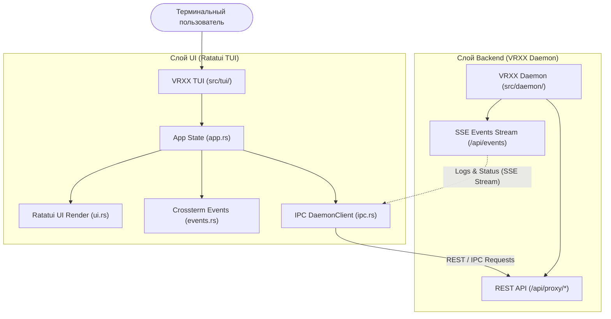

# 09. TUI Интерфейс (`vrxx tui`)

## Обзор

TUI (Terminal User Interface) предоставляет консольный интерактивный интерфейс управления VRXX VPN-клиентом на базе библиотек `ratatui` и `crossterm`. Интерфейс позволяет полностью управлять подключениями, режимами работы, профилями и просматривать логи без использования графической оболочки (GUI).

TUI можно запустить через подкоманду основного бинарника `vrxx tui` или через отдельный исполняемый файл `vrxx-tui`.

---

## Архитектура TUI

1. **Изоляция слоев**: TUI не выполняeт сетевую маршрутизацию (`ip route`) и не управляет дочерними процессами `sing-box` напрямую. Все управляющие действия отправляются в `DaemonClient`.
2. **Безопасность терминала**: Настройка raw-режима (`crossterm::terminal::enable_raw_mode`) и переключение экрана (`EnterAlternateScreen`) автоматически восстанавливаются при выходе или завершении программы.
3. **Параллельная работа**: Завершение или закрытие TUI (`q`) не рвет активное фоновое VPN-соединение и не препятствует параллельной работе GUI.

---

## Использование и горячие клавиши

| Горячая клавиша | Действие |
| --- | --- |
| `Space` / `Enter` | Подключить / Отключить выбранный сервер |
| `Tab` | Сменить режим маршрутизации (TUN / Proxy) |
| `Up` / `Down` / `k` / `j` | Навигация по списку профилей (ключей) |
| `l` / `L` | Открыть / Закрыть всплывающее окно логов (Logs Overlay) |
| `q` / `Q` / `Esc` | Выход из TUI (без разрыва соединения) |

---

## Макет интерфейса

- **Верхняя панель (Header)**: Отображает статус подключения (`CONNECTED` / `DISCONNECTED` / `ERROR`), текущий режим (`TUN` / `Proxy`) и имя активного сервера.
- **Центральная панель (Body)**:
  - **Спектрограммы скорости (Sparklines)**: Графическое представление входящей (Download) и исходящей (Upload) скорости трафика в реальном времени.
  - **Список профилей (Profiles)**: Список доступных конфигурационных ключей с маркером активного сервера.
- **Нижняя панель (Footer)**: Подсказки актуальных горячих клавиш.
- **Окно логов (Modal Overlay)**: Отображается поверх основного интерфейса по нажатию `l`, транслируя события логов демона через SSE-поток в реальном времени.
