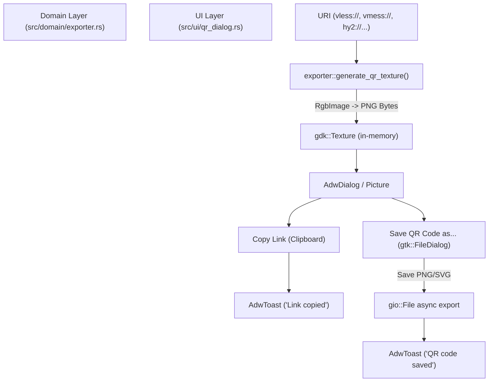

# 10. Генератор QR-Кодов и Шеринг Профилей

## 1. Назначение и Архитектура
Модуль шеринга профилей в VRXX разработан для быстрого экспорта подключений на мобильные устройства (смартфоны, планшеты) посредством сканирования QR-кода, а также для копирования конфигурационных ссылок в системный буфер обмена.

Модуль состоит из двух основных слоев:
- **Domain Layer (`src/domain/exporter.rs`)**: Независимая чистая логика рендеринга матрицы QR-кодов в векторный SVG или растровый PNG формат с использованием библиотек `qrcode` и `image`.
- **UI Layer (`src/ui/qr_dialog.rs`)**: Модальный интерфейс на базе `AdwDialog` (`adw::AlertDialog` + `adw::ToastOverlay`), отображаемый из контекстного меню любого ключа (`VrxxVpnKeyRow`).

---

## 2. Генерация QR-кода в памяти (`src/domain/exporter.rs`)
Одной из важнейших обязанностей приложения является соблюдение конфиденциальности и надежности. Рендеринг QR-кода не создает никаких временных файлов в директориях типа `/tmp` или `~/.cache`.

### Рендеринг в `gdk::Texture`:
1. Строка URI кодируется в матрицу с помощью `qrcode::QrCode::new(content)`.
2. Графический буфер растра строится с помощью `code.render::<image::Rgb<u8>>()`.
3. Изображение кодируется в формат PNG в оперативной памяти с использованием `std::io::Cursor<Vec<u8>>`.
4. Из байтов создается вектор `glib::Bytes`, который оборачивается в объект `gdk::Texture::from_bytes(&bytes)`.

---

## 3. Интерактивный диалог (`src/ui/qr_dialog.rs`)

### Компоненты UI:
- **Белый контрастный контейнер (`card`)**: Из-за наличия системной темной темы сканирование черного QR-кода на темном фоне может вызывать трудности у камер смартфонов. В VRXX виджет `gtk::Picture` помещен внутрь белого рамки-карточки, что гарантирует мгновенное считывание независимо от системной темы Linux.
- **Кнопка «Скопировать ссылку»**: Копирует оригинальный URI в системный буфер обмена `parent.clipboard()` и вызывает всплывающий `AdwToast`.
- **Кнопка «Сохранить QR-код как...»**: Использует нативный `gtk::FileDialog` среды рабочей стола.
  - Поддерживает выбор фильтров форматирования: `PNG Image (*.png)` и `SVG Vector (*.svg)`.
  - Предоставляет асинхронное неблокирующее сохранение файла через `file_dialog.save(...)`.

---

## 4. Локализация и Безопасность
- **Локализация (`gettext`)**: Все элементы интерфейса (заголовок, кнопки, всплывающие уведомления `AdwToast`, фильтры файлов) обернуты в `gettext("...")` и имеют локализованные переводы в `po/ru.po` и `po/en.po`.
- **Обработка ошибок**: Отсутствуют вызовы `.unwrap()` / `.expect()`. В случае ошибки кодирования или сохранения файла выводятся информативные уведомления `AdwToast`.
